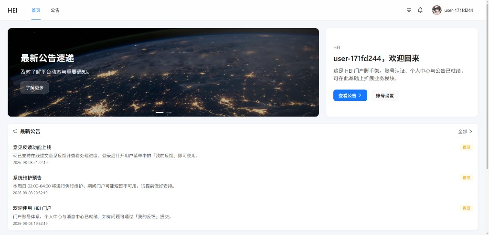
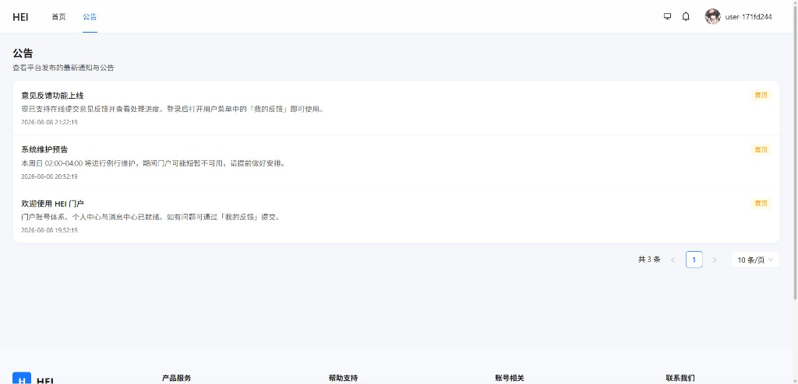
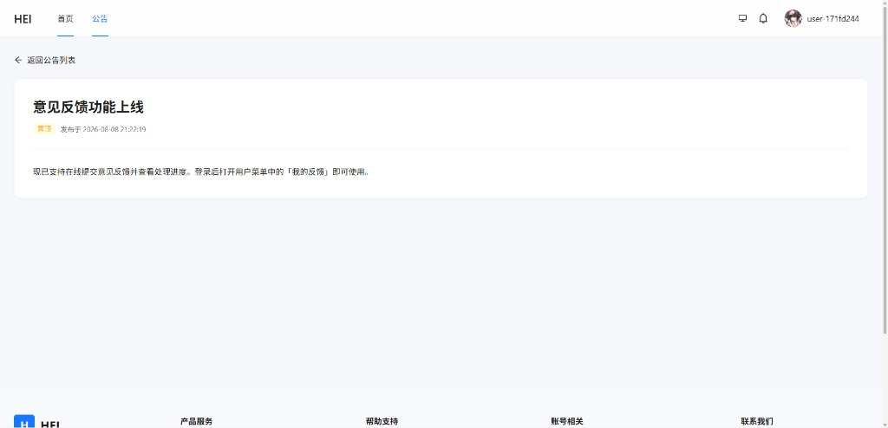
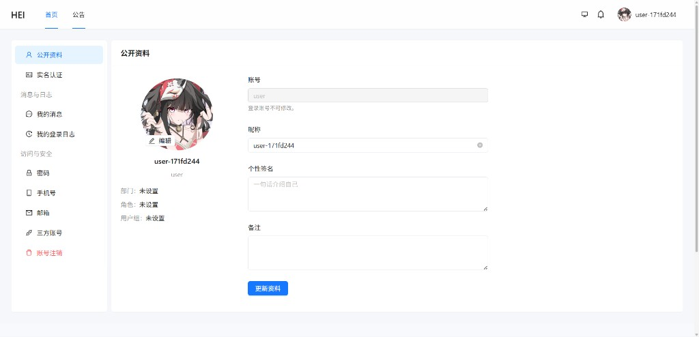
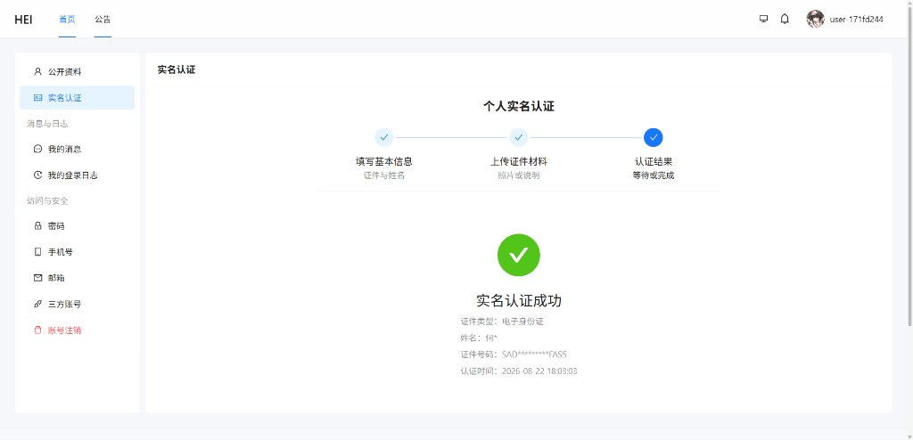
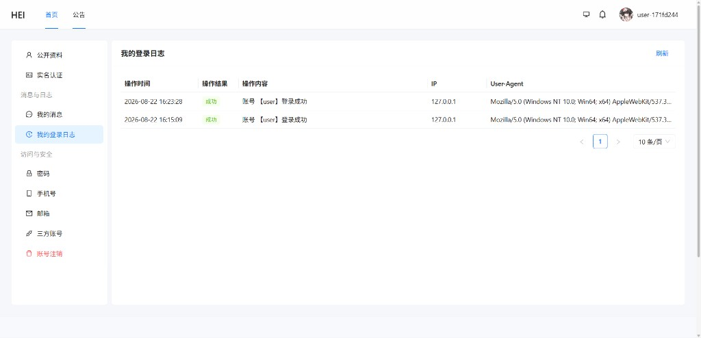
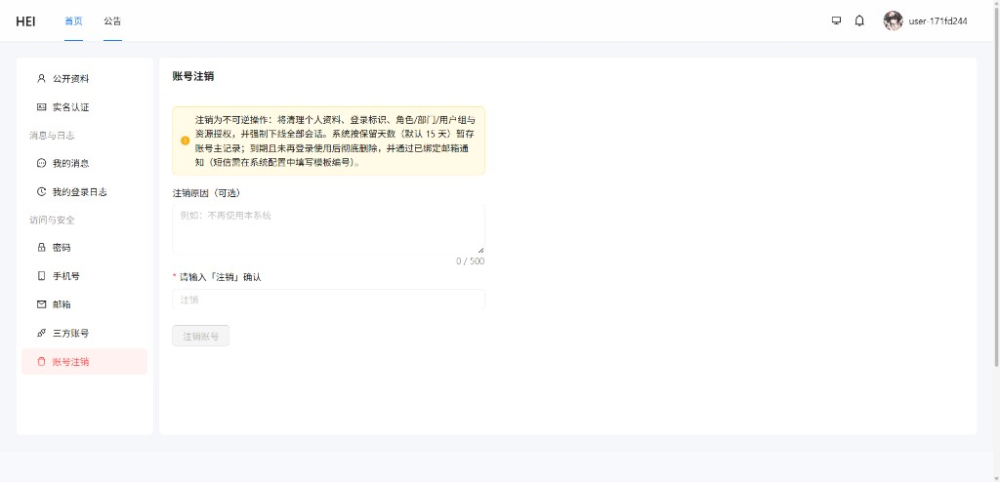

# HEI Portal


**HEI Portal** 是 HEI 系列的通用门户前端：基于 React 19 与 Ant Design，对接 **PORTAL** 账号体系（`/api/v1/portal/*`）。同一套界面可挂载 [hei-boot](https://github.com/jiangbyte/hei-boot)、[hei-gin](https://github.com/jiangbyte/hei-gin) 等姊妹后端，通过环境变量切换 API 代理即可，无需改业务代码。

> 当前版本：`1.0.0-beta` · 协议：[Apache License 2.0](LICENSE)

## 目录

- [界面预览](#界面预览)
- [功能特性](#功能特性)
- [技术栈](#技术栈)
- [快速开始](#快速开始)
- [常用命令](#常用命令)
- [Docker](#docker)
- [工程结构](#工程结构)
- [姊妹项目](#姊妹项目)
- [License](#license)

## 界面预览

### 门户首页

Banner 轮播、欢迎卡片与最新公告摘要，作为登录后的默认入口。

<table>
  <tr>
    <td></td>
  </tr>
  <tr>
    <td align="center">门户首页</td>
  </tr>
</table>

### 公告中心

公告列表（置顶、分页）与详情页，支持从首页快捷跳转。

<table>
  <tr>
    <td width="50%"></td>
    <td width="50%"></td>
  </tr>
  <tr>
    <td align="center">公告列表</td>
    <td align="center">公告详情</td>
  </tr>
</table>

### 个人中心

资料维护、实名认证、消息、登录日志与安全设置（密码 / 手机 / 邮箱 / 三方绑定 / 账号注销）。

<table>
  <tr>
    <td width="50%"></td>
    <td width="50%"></td>
  </tr>
  <tr>
    <td align="center">公开资料</td>
    <td align="center">实名认证</td>
  </tr>
  <tr>
    <td width="50%"></td>
    <td width="50%"></td>
  </tr>
  <tr>
    <td align="center">我的登录日志</td>
    <td align="center">账号注销</td>
  </tr>
</table>

## 功能特性

门户侧能力按模块划分如下，API 前缀统一为 `/api/v1/portal/*`：

| 模块 | 说明 |
| --- | --- |
| 认证与会话 | 登录 / 注册 / 找回与重置密码（`/auth/*`）；Cookie 会话（可关，仅 Header）；可配置三方登录入口 |
| 门户首页 | Banner 轮播、欢迎卡片、最新公告摘要与快捷入口 |
| 公告中心 | 公告列表（置顶、分页）、公告详情 |
| 意见反馈 | 在线提交反馈、查看处理进度（用户菜单「我的反馈」） |
| 个人资料 | 公开资料、头像上传、昵称与个性签名 |
| 实名认证 | 分步填写与证件上传、认证结果展示（敏感信息脱敏） |
| 消息与日志 | 我的消息、我的登录日志（含 User-Agent，列表直出无弹窗） |
| 访问与安全 | 密码、手机号、邮箱、三方账号绑定 |
| 账号管理 | 账号注销（冷静期说明与确认流程） |
| 站点信息 | 页脚版权与备案信息（`GET /api/v1/public/site-footer`，支持本地兜底文案） |

## 技术栈

| 类别 | 技术 |
| --- | --- |
| 框架 | React 19 · Vite · TypeScript |
| UI | Ant Design 6 · UnoCSS · Iconify |
| 状态与路由 | Zustand · React Router |
| 网络 | axios（Cookie 会话，开发期走 Vite 代理） |
| 其他 | ESLint · Prettier |

主题 token：[`src/theme/tokens.ts`](src/theme/tokens.ts)。

## 快速开始

### 环境要求

- Node.js 18+
- pnpm 8+

### 本地运行

```bash
# 建议先启动姊妹后端，默认 http://127.0.0.1:8000
pnpm install
pnpm dev
```

开发地址默认：http://127.0.0.1:5174

### 环境变量

参考 [`.env.example`](.env.example)：

| 变量 | 说明 | 默认 |
| --- | --- | --- |
| `VITE_APP_TITLE` | 站点标题 | `HEI` |
| `VITE_PORT` | 开发端口 | `5174` |
| `VITE_HOME_PATH` | 登录后首页 | `/` |
| `VITE_API_URL` | API 基址；留空则走同源 `/api` | 空 |
| `VITE_API_PROXY_TARGET` | Vite 代理目标 | `http://127.0.0.1:8000` |
| `VITE_COPYRIGHT_INFO` 等 | 页脚兜底文案（可选，优先用后端配置） | — |

生产构建见 [`.env.production`](.env.production)：`VITE_API_URL` 留空，由 nginx 反代 `/api`。

默认演示账号见各后端仓库 README（Portal：`user` / `123456`）。

## 常用命令

```bash
pnpm dev          # 本地开发
pnpm build        # 类型检查 + 构建
pnpm preview      # 预览构建产物
pnpm lint         # ESLint
pnpm format       # Prettier
```

## Docker

本目录提供 `Dockerfile` 与 `nginx/`（容器内监听 **80**）。

```bash
pnpm build   # 可选；镜像内也会执行 vite build

docker build -t hei-portal .
docker run -d \
  -e BACKEND_URL="http://host.docker.internal:8000" \
  -p 8082:80 \
  hei-portal
```

常用环境变量：`BACKEND_URL`、`CLIENT_MAX_BODY_SIZE`（默认 `10m`）。

## 工程结构

```text
hei-portal/
├── docs/images/     # README 截图
├── nginx/           # 生产 nginx 模板
└── src/
    ├── api/         # 接口封装
    ├── components/  # 通用组件
    ├── layouts/     # 布局壳
    ├── pages/       # 页面（auth / home / announcements / feedback / usercenter）
    ├── router/      # 路由与守卫
    ├── stores/      # Zustand
    ├── theme/       # 主题 token
    └── utils/       # 工具
```

## 姊妹项目

| 项目 | 说明 | 协议 |
| --- | --- | --- |
| [hei-boot](https://github.com/jiangbyte/hei-boot) | Spring Boot 后端（推荐） | Apache License 2.0 |
| [hei-gin](https://github.com/jiangbyte/hei-gin) | Go / Gin 后端 | Apache License 2.0 |
| [hei-fastapi](https://github.com/jiangbyte/hei-fastapi) | FastAPI 后端 | Apache License 2.0 |
| [hei-admin](https://github.com/jiangbyte/hei-admin) | 管理端前端（Vue 3） | Apache License 2.0 |
| [hei-admin-uniapp](https://github.com/jiangbyte/hei-admin-uniapp) | 管理端移动端（uni-app） | Apache License 2.0 |

开发期 Cookie 会话依赖 Vite 同源代理；若将 `VITE_API_URL` 指向跨域后端，需自行配置 CORS 与 Cookie `SameSite`。与管理端共用同一后端进程时，端口与 Cookie Path 按端隔离（`/api/v1/portal`）。

## License

本项目基于 [Apache License 2.0](LICENSE) 开源，可自由使用、修改与分发。完整条款见仓库根目录 [LICENSE](LICENSE) 文件。
